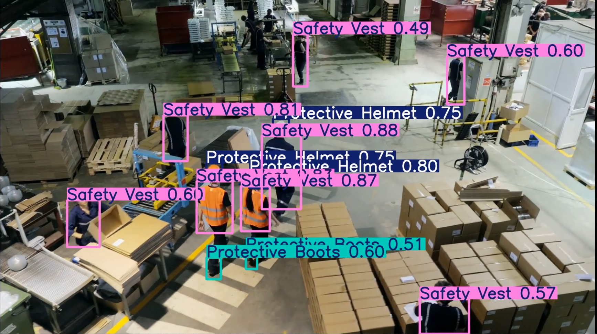

# 🦺 Personal Protective Equipment (PPE) Detection with YOLOv12
 

- This project uses **YOLOv12** for detecting **Personal Protective Equipment (PPE)** such as helmets, vests, gloves, and boots.

## 🎯 Objective

- The goal of this project is to improve **safety in workplaces** by automatically detecting whether people are wearing the required protective gear using real-time object detection.

## ⚙️ How to Run

1. **Download the notebook** file from this repository.
2. Open it in **Google Colab** or **Kaggle**.
3. Make sure to **activate the GPU** from the runtime settings.
4. Run all the cells to test the model.

